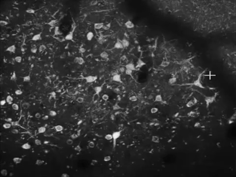
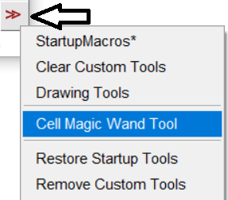
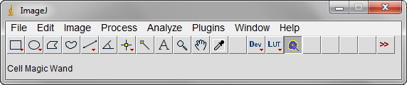
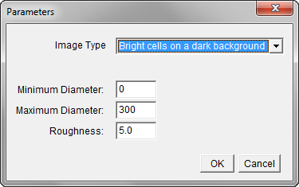
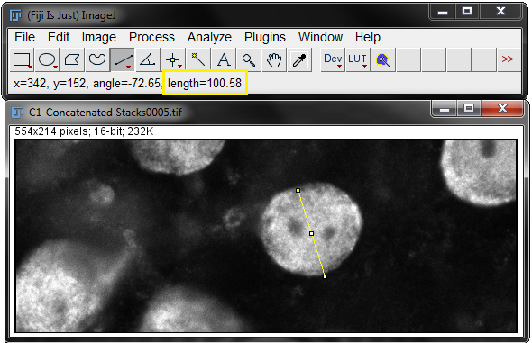
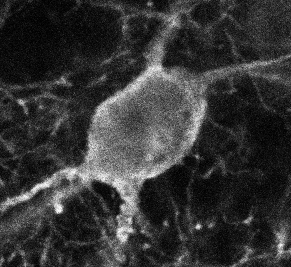
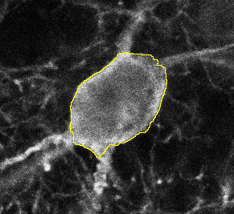

## Cell Magic Wand

ImageJ plugin for rapid human-assisted segmentation of cells in images.

### Description

Click on a cell. Get an ROI around the cell.

### Download and Install

Download: [Cell_Magic_Wand_Tool.jar](Cell_Magic_Wand_Tool/Cell_Magic_Wand_Tool.jar)

Version Required: [ImageJ](https://imagej.nih.gov/ij/download.html) version 1.46d (January 2012) or later.

Install: Put Cell_Magic_Wand_Tool.jar into the `plugins\Tools` directory of your ImageJ installation. You may need to create the "Tools" directory.

Example: `C:\Program Files\ImageJ\plugins\Tools\Cell_Magic_Wand_Tool.jar`.

Restart ImageJ and select Cell Magic Wand Tool from the ">>" menu on the right side of the toolbar:

Cell Magic Wand will appear in your ImageJ toolbar:

Try it out on this [test image](img/cells.tif).

### Parameters

Double click on the tool to bring up this box.

**Image Type:** Are your cells brighter or darker than the background color?

**Minimum Diameter:** What's the smallest your cell could be (in pixels)?

**Maximum Diameter:** What's the largest your cell could be (in pixels)?

If you like, you can set the minimum diameter to 1 and the maximum diameter to something huge (like 1000). Cell Magic Wand will still work. But it'll work better the more information you give it.

In particular, setting the maximum diameter lower can prevent Cell Magic Wand from encircling multiple cells at once. Setting the minimum diameter higher helps Cell Magic Wand to ignore high-contrast elements inside your cell, such as nucleoli. And having a smaller range of diameters to search through makes Cell Magic Wand run faster, too.

**Roughness:** This is a shape parameter that controls how rough the edge of your cell ROI will be. Lower it for a smooth ROI that follows the general shape of your cell. Raise it for a rough ROI that delves into every nook and cranny on the outside of your cell. Reasonable values are 0 to 10. A value of 0 will give you a circle -- the smoothest ROI of all.

### Tips

**Shift-clicking:** Hold down SHIFT to select multiple cells. The ROI manager will appear and keep track of your selections. Shift-clicking on a cell you've already selected will deselect it.

**Measure cell diameter:** Use the Line ROI tool to draw a line across your cell. Length will be shown in the ImageJ main window, or you can press Ctrl+M to bring up a measurement. If your units aren't in pixels, you must change the units to pixels first: do Analyze->Set Scale->Click to remove scale, and click OK.

This will help you determine good values for Minimum and Maximum Diameter.

**Hide ROIs from other slices:** If you're working with an image stack, you may want to make it so that ROIs only show up on the slice they came from. From the ROI manager window, choose More->Options->Associate "Show All" ROIs with slices.

**Median Filtering:** If there is significant contrast variability inside of your cells, try using a median filter to blur out those elements first. Process->Filters->Median.

(1)  (2)  

(3)  (4)  

(1) Original image, (2) Median-filtered image, (3) ROI drawn on median filtered image, (4) ROI on original image.

**Multichannel and RGB Images:** The first channel, or the red color, will be what Cell Magic Wand sees. Convert images to grayscale or split channels if you want to detect cells in a different channel.

### Credits

Plugin created by Theo Walker.

GCaMP images thanks to William Bosking and Sharon Huang.

Confocal microscopy images thanks to Amanda Jacob and Dominick Casciato.

Cell Magic Wand v1.0 released Jan. 23, 2014. Docs updated Dec. 21, 2020.